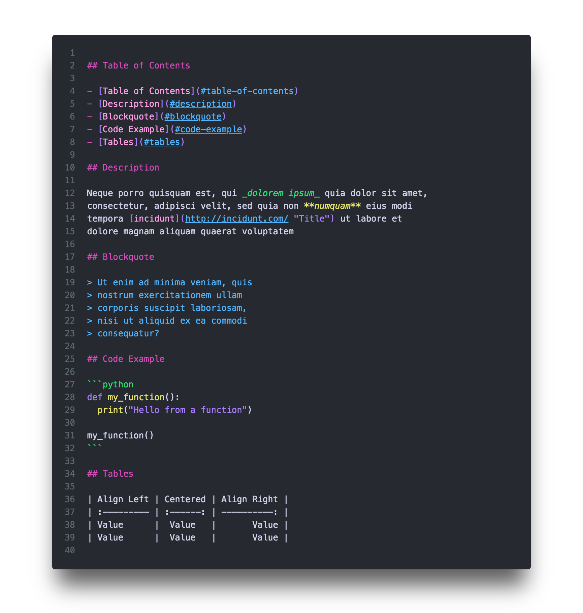
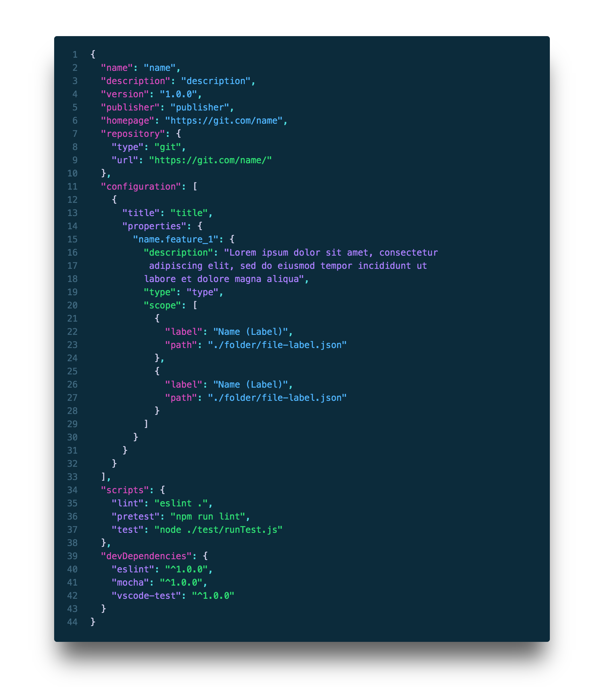
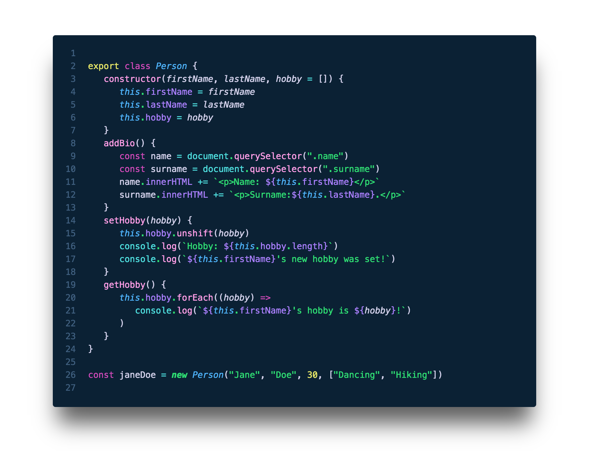
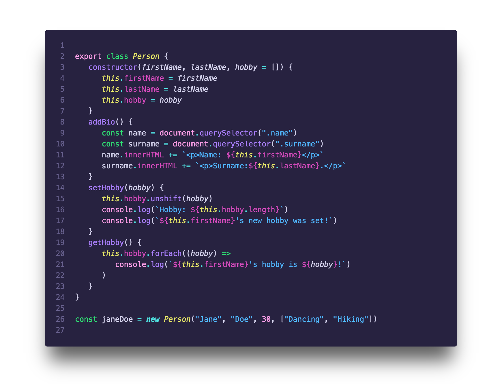
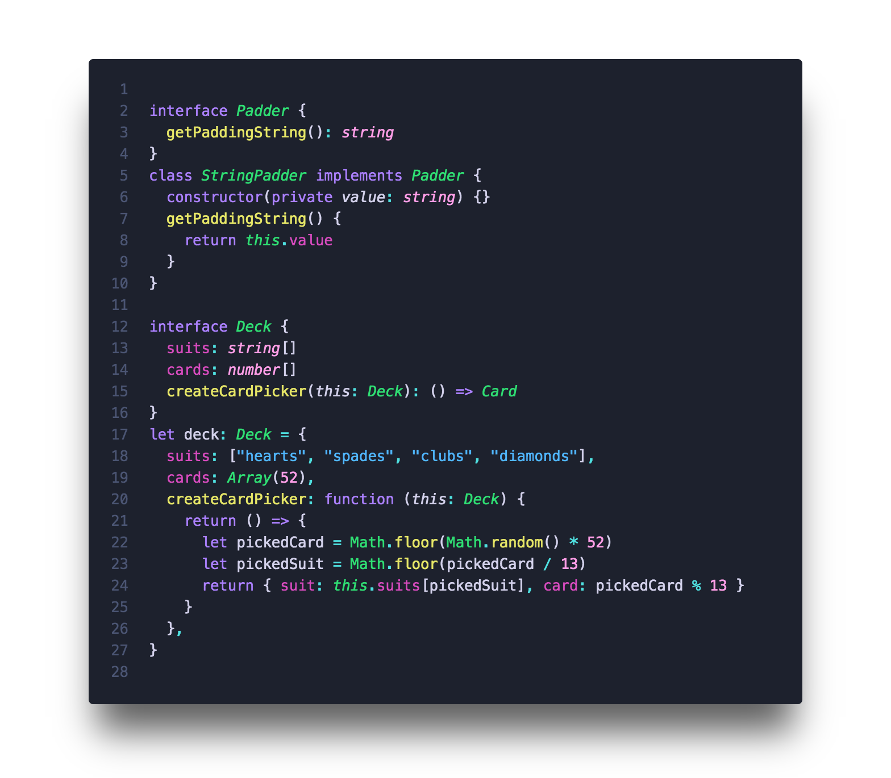
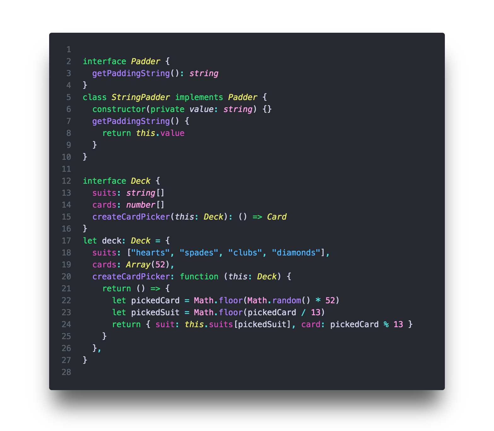
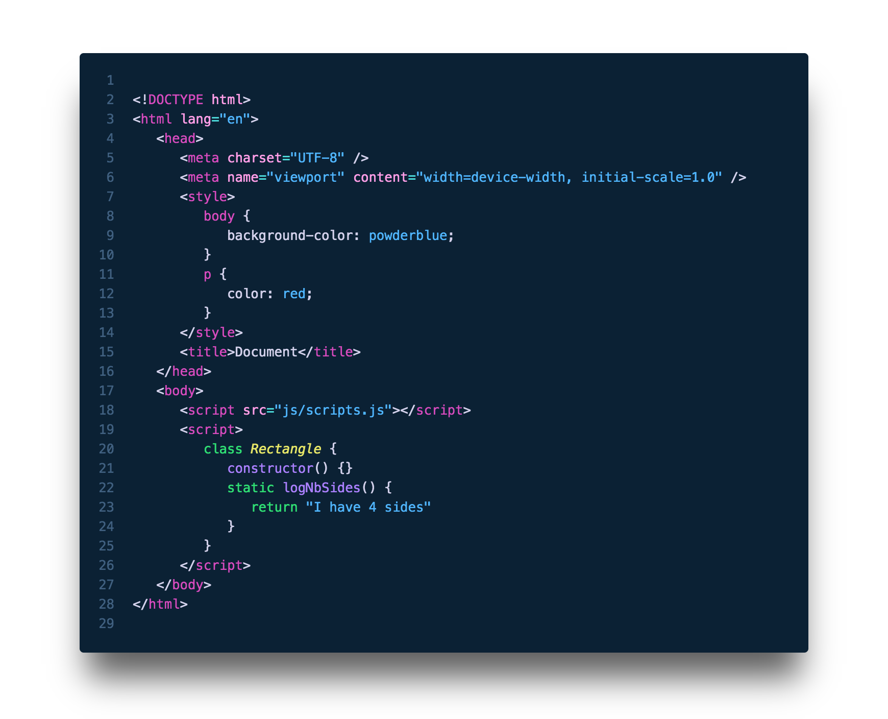
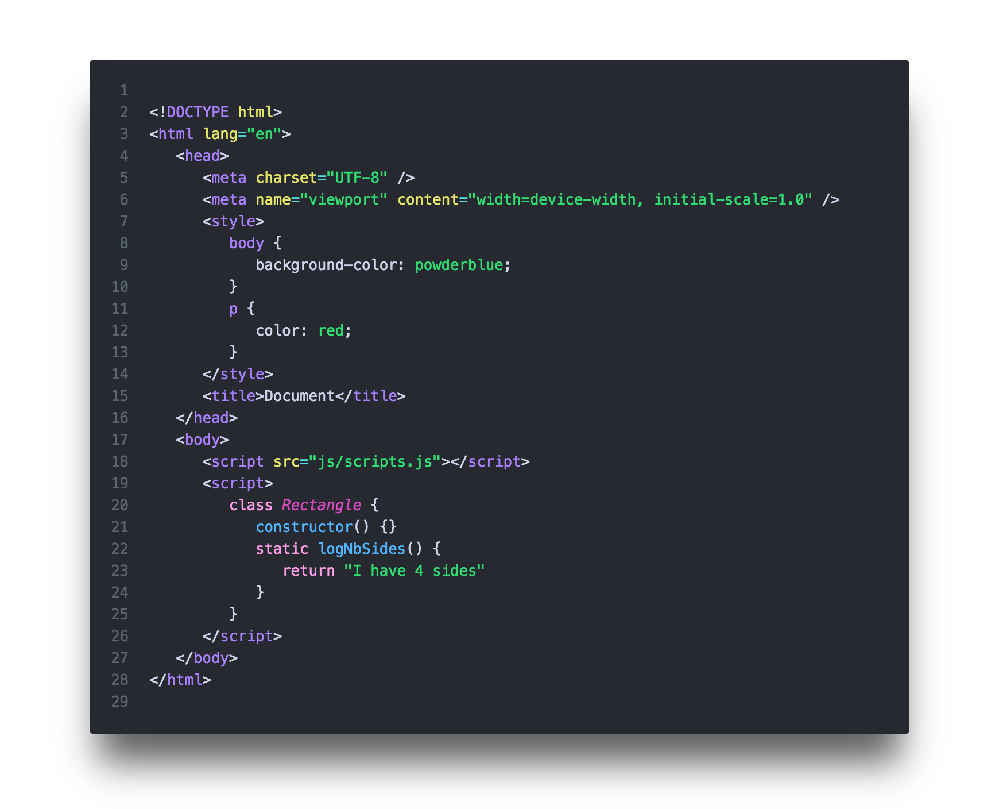

### [◂ HOME](../README.md) <!-- omit in toc -->

## Nebula Syntax <!-- omit in toc -->

**Nebula Syntax** was born by chance and not by design. Initially it was just me trying to add purple to a different color palette, but it didn't work and I ended up creating a completely new color palette.

I kept tweaking the colors until I reached a balance and harmony that allowed for more color combinations. I kept trying different combinations until - several pints and comparisons later - I started to see a pattern of what worked and what not so I could create the **Color Schemes**.

### Table of Contents

- [Color Schemes](#color-schemes)
- [Comments](#comments)
- [Color Scheme - Universal](#color-scheme---universal)
    - [Markdown](#markdown)
- [Color Schemes - by Pair](#color-schemes---by-pair)
  - [JSON](#json)
- [Color Schemes - by Language](#color-schemes---by-language)
  - [Javascript](#javascript)
  - [Typescript](#typescript)
  - [HTML](#html)
  - [CSS](#css)

## Color Schemes

I wanted the different color schemes to have a different feel from each other instead of a simple color swap. I also wanted to maintain a certain coherence so a color scheme can fall back to their pair, which then fall back to the syntax colors.

There are 4 colors that are shared among all 4 color schemes. Variables are **White**, Punctuations are **Cyan**, Invalid are **Red** and Deprecated are **Brown**.

**Hourglass and Spirograph** share some colors in common, for instance, Strings are **Blue** while Properties are **Magenta** and Numbers are **Pink**. For **Pegasus and Cerberus**, they have **Green** Strings, Properties are **Purple** and numbers are **Yellow**.

The remaining colors of each **Color Scheme** are completely different between them. There were some colors that I wanted to pair together more often, be it because they worked well together but also to try to reproduce the **_Nebula colors_** throughout the code.

When everything made sense and there was nothing left bothering me, then I finally felt like I finished this project - although that happened several times and every time there was something new to change or improve, so maybe this will be endless, hopefully not.

*Nebulas images:*

## Comments

Sometimes, depending on the time of the day or the lighting, I find the default **grey for comments** a bit harder to read in a glimpse.

But I wanted to have more options so I tried to provide like an alternative version of the RGB, but at the same time, I didn't want it to match the colors that were already used in the **Nebula Syntax** - which wasn't very easy.

There are 4 colors for comments, the standard **grey**, but also **violet**, **magenta** and **forest**, each of the colors have a lighter and a darker version, for a total of **8 options**.

[
⬆
](#table-of-contents)  

## Color Scheme - Universal

#### Markdown

**Markdown** has a universal color combination, so it's the same for any **Color Scheme** you choose.

*
 <spam>Background Color:</spam> **<spam> Grey</spam>** 
*

[
⬆
](#table-of-contents)

## Color Schemes - by Pair

### JSON

In **JSON** files the **key** and **value** pairs alternate in colors for each level. It follows the **property** and **string** colors of the **Color Schemes**.

#### Hourglass and Spirograph <!-- omit in toc -->

*
 <spam>Background Color:</spam> **<spam> Blue</spam>** 
*

[
⬆
](#table-of-contents)

### Pegasus and Cerberus <!-- omit in toc -->

*
 <spam>Background Color:</spam> **<spam> Purple</spam>** 
*

[
⬆
](#table-of-contents)

## Color Schemes - by Language

### Javascript

#### Hourglass <!-- omit in toc -->

*
 <spam>Background Color:</spam> **<spam> Grey</spam>** 
*

#### Pegasus <!-- omit in toc -->

*
 <spam>Background Color:</spam> **<spam> Glacial Blue</spam>** 
*

#### Spirograph <!-- omit in toc -->

*
 <spam>Background Color:</spam> **<spam> Purple</spam>** 
*

#### Cerberus <!-- omit in toc -->

*
 <spam>Background Color:</spam> **<spam> Blue</spam>** 
*

[
⬆
](#table-of-contents)

### Typescript

#### Hourglass <!-- omit in toc -->

*
 <spam>Background Color:</spam> **<spam>Dark Grey</spam>** 
*

#### Pegasus <!-- omit in toc -->

*
 <spam>Background Color:</spam> **<spam>Purple</spam>** 
*

#### Spirograph <!-- omit in toc -->

*
 <spam>Background Color:</spam> **<spam>Grey</spam>** 
*

#### Cerberus <!-- omit in toc -->

*
 <spam>Background Color:</spam> **<spam> Blue</spam>** 
*

[
⬆
](#table-of-contents)

### HTML

#### Hourglass <!-- omit in toc -->

*
 <spam>Background Color:</spam> **<spam> Deep Purple</spam>** 
*

#### Pegasus <!-- omit in toc -->

*
 <spam>Background Color:</spam> **<spam> Dark Grey</spam>** 
*

#### Spirograph <!-- omit in toc -->

*
 <spam>Background Color:</spam> **<spam> Glacial Blue</spam>** 
*

#### Cerberus <!-- omit in toc -->

*
 <spam>Background Color:</spam> **<spam> Grey</spam>** 
*

[
⬆
](#table-of-contents)

### CSS

#### Hourglass <!-- omit in toc -->

*
 <spam>Background Color:</spam> **<spam> Blue</spam>** 
*

#### Pegasus <!-- omit in toc -->

*
 <spam>Background Color:</spam> **<spam> Purple</spam>** 
*

#### Spirograph <!-- omit in toc -->

*
 <spam>Background Color:</spam> **<spam> Dark Grey</spam>** 
*

#### Cerberus <!-- omit in toc -->

*
 <spam>Background Color:</spam> **<spam> Deep Purple</spam>** 
*

[
⬆
](#table-of-contents)
