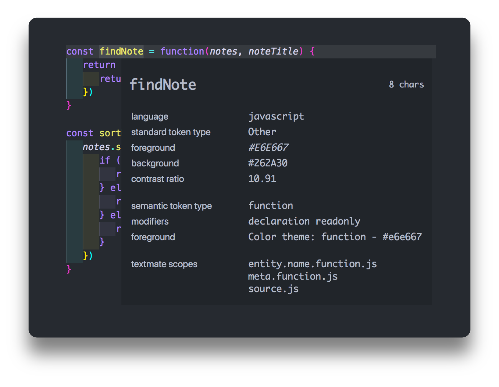

### [◂ HOME](../README.md) <!-- omit in toc -->

## VSCode Customization <!-- omit in toc -->

This is just a quick guide on how to customize **VSCode**. How to customize the **Workbench**, the **Syntax** and also how to install **ZSH Terminal**.

### Table of Contents

- [ZSH Terminal](#zsh-terminal)
- [Customizing your VSCode](#customizing-your-vscode)
- [Oni UI](#oni-ui)
- [Nebula Syntax](#nebula-syntax)
- [Semantic Token](#semantic-token)
- [TextMate Token](#textmate-token)

## ZSH Terminal

For more information on how to customized it, I've followed this [tutorial](https://medium.com/@shivam1/make-your-terminal-beautiful-and-fast-with-zsh-shell-and-powerlevel10k-6484461c6efb) that has instructions for **Windows**, **Mac** and **Linux**.


### My Settings <!-- omit in toc -->

```json
 "terminal.integrated.defaultProfile.osx": "zsh",
 "terminal.integrated.fontFamily": "MesloLGS NF",
 "debug.console.fontFamily": "MesloLGS NF",
 "terminal.integrated.fontWeightBold": "normal",
 "terminal.integrated.cursorStyle": "line",
 "terminal.integrated.cursorWidth": 2,
 "terminal.integrated.lineHeight": 1.1
```

I use the these settings but `Hack NF` and `FiraCode NF` are also good font options. For more information check out [Nerd Fonts](https://www.nerdfonts.com/).

[<div align="right">⬆</div>](#table-of-contents)

## Customizing your VSCode

### Specific Theme <!-- omit in toc -->

When you change your settings, just substitute `NAME-OF-THE-THEME` by the name that appears on `Setttings > Workbench > Appearance > Color Theme Menu`.

For example: `[Nebula Oni (Hourglass)]`.

```json
"customizations": {
  "[Nebula Oni (Hourglass)]": {
    "rule1": "color",
    "rule2": "color"
  }
}
```

### All Themes <!-- omit in toc -->

You can also set it for all themes by excluding the `NAME-OF-THE-THEME` bracket.

```json
"customizations": {
    "rule1": "color",
    "rule2": "color"
}
```

## Oni UI

These settings change the VSCode Interface. For more information, check the VSCode documentation for [color theme customization](https://code.visualstudio.com/api/references/theme-color).

```json
"workbench.colorCustomizations": {
  "[NAME-OF-THE-THEME]": {
  "foreground": "#B4BBC8",
  "selection.background": "#5124B3A6",
  "editor.background": "#262A30"
  }
}
```

[<div align="right">⬆</div>](#table-of-contents)

## Nebula Syntax

If you want to customize the syntax colors, you have two options depending on what you are targetting. Your main tool will be the `Developer: Inspect Editor Tokens and Scopes` and the `settings.json` file.

Just open your `Command Palette` and search for it. You can target a certain parameter by either targetting it by `Semantic Token` or `TextMate Token`.

If there is a conflict between `Semantic Token` or `TextMate Token`, VSCode will probably give the `Semantic Token` priority and it will override the `TextMate Token` color rule.

### Font Style <!-- omit in toc -->

For `fontStyle` you can choose `regular`, `italic`, `bold` or `underline` or just combine them `underline italic` or `bold italic`.

```json
{
  "fontStyle": "underline bold italic"
}
```

[<div align="right">⬆</div>](#table-of-contents)

## Semantic Token

In this example, the function is colored by the `function` `Token Type`, a more general parameter, but you can also target it by adding a `Token Modifier` like `function.declaration` or `function.readonly` if you want to be more specific.



[<div align="right">⬆</div>](#table-of-contents)

### Semantic Token Example <!-- omit in toc -->

```json
"editor.semanticTokenColorCustomizations": {
  "[NAME-OF-THE-THEME]": {
    "rules": {
      "function.declaration": {
        "foreground": "#2FDE73",
        "fontStyle": "bold italic"
      },
      "function": "#2FDE73" // if it's just the foreground
    }                       // you can just use it as a String
  }
}
```

You can also target by language:

```json
"variable.readonly:java":"#4FE0E0" // only for Java
```

Or by `Token Modifier`:

```json
"*.defaultLibrary": {
    "fontStyle": "bold" // all defaultLibrary will be bold
  }
```

#### More Info (Semantic Tokens) <!-- omit in toc -->

[Semantic Highlight Guide](https://code.visualstudio.com/api/language-extensions/semantic-highlight-guide#semantic-token-classification)

[<div align="right">⬆</div>](#table-of-contents)

## TextMate Token

On `TextMate` you can either specifically target a `textmate scope` like `entity.name.function` without the `file extension`, which will target all functions for all languages or you can change something specific for a language like `entity.name.function.js`, which will only affect `Javascript`.

Into the `scope` you can either put the `string` directly or use multiple `textmates` strings inside an `array`. You can also put multiple `textmate` into a single string if you separate them by a comma, but I wouldn't recommend that.

You can also chain scopes to be more specific like `source.js meta.function.arrow.js entity.name.function.js`. The best way is trying and testing it.


[<div align="right">⬆</div>](#table-of-contents)

### TextMate Token Example <!-- omit in toc -->

```json
"editor.tokenColorCustomizations":{
  "[NAME-OF-THE-THEME]": {
    "textMateRules": [
      { // "scope" value as a String
        "scope": "source.js meta.function.arrow.js entity.name.function.js",
        "settings": {
          "foreground": "#FF9EE7"
        }
      },
      { // "scope" value as an Array of textmates
        "scope":["entity.name.function", "storage.type"],
        "settings": {
          "foreground": "#D3D1EB",
          "fontStyle": "regular"
        }
      }
    ]
  }
}
```

#### More Info (TextMate Tokens) <!-- omit in toc -->

[Syntax Highlight Guide](https://code.visualstudio.com/api/language-extensions/syntax-highlight-guide)

[<div align="right">⬆</div>](#table-of-contents)
