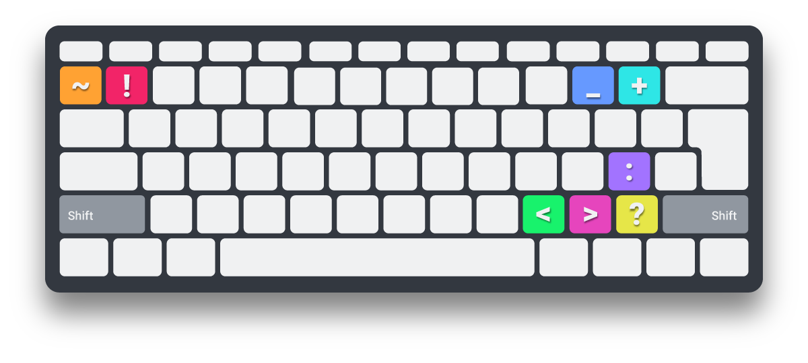

### [◂ HOME](../README.md) <!-- omit in toc -->

## Extension's Customization <!-- omit in toc -->

I've customized extensions that are color-related, so if someone would like colors that match `Nebula Syntax`, I'm sharing my settings.

### Table of Contents

- [Better Comments](#better-comments)
- [Bracket Pair Colorizer](#bracket-pair-colorizer)
- [Indent Rainbow](#indent-rainbow)

## Better Comments

I customized the tags that trigger the colors as well as the colors themselves. For now these are my settings and I might change it in the future, who knows? I've lost count of how many times I've changed colors throughout the process of making of this theme, so it might happen again.



All **triggers** need the **Shift Key** except for the ~~**strikethrough**~~ _(double slash: **/ /** )_.

For the other tags, you basically have 4 triggers in the **numbers row**, a pair on the **far left** `~` and `!` and another on the **far right** `_` and `+` and then the 4 colors I use the most are near the **Right Shift** `<` and `>` and then `?` and `:`.


```json
"better-comments.tags": [
  {
   "backgroundColor": "transparent",
   "color": "#F22468",
   "strikethrough": false,
   "tag": "!"
  },
  {
   "backgroundColor": "transparent",
   "color": "#FFA233",
   "strikethrough": false,
   "tag": "~"
  },
  {
   "backgroundColor": "transparent",
   "color": "#6699FF",
   "strikethrough": false,
   "tag": "_"
  },
  {
   "backgroundColor": "transparent",
   "color": "#2EE6E6",
   "strikethrough": false,
   "tag": "+"
  },
  {
   "backgroundColor": "transparent",
   "color": "#18F26C",
   "strikethrough": false,
   "tag": "<"
  },
  {
   "backgroundColor": "transparent",
   "color": "#E645BD",
   "strikethrough": false,
   "tag": ">"
  },
  {
   "backgroundColor": "transparent",
   "color": "#E6E648",
   "strikethrough": false,
   "tag": "?"
  },
  {
   "backgroundColor": "transparent",
   "color": "#A273FF",
   "strikethrough": false,
   "tag": ":"
  },
  {
   "backgroundColor": "transparent",
   "color": "#737880",
   "strikethrough": true,
   "tag": "//"
  }
 ]
```

[<div align="right">⬆</div>](#table-of-contents)

## Bracket Pair Colorizer

Initially I was trying to make them different from the **Nebula Syntax**, so I wouldn't confuse them, but it's hard to use colors that are different enough because if they are close and almost the same color, it kind of bothers me.

These **6 colors** have the same **hue** as the colors from **Nebula Syntax** and I combine them in a way that the colors I prefer appear more often and that each pair can work well together within the iteration cycle.

It was quite a hassle, but in the end, I think it works well and it's aesthetically pleasing.

I made this combination for **Hourglass** and **Spirograph**:


```json
 "bracket-pair-colorizer-2.colors": [
  "#E63AC8",
  "#00FFFF",
  "#FFEA00",
  "#AB80FF",
  "#00FF64",
  "#59BAFF"
 ]
```


And this one for **Pegasus** and **Cerberus**:


```json
 "bracket-pair-colorizer-2.colors": [
  "#00FF64",
  "#FFEA00",
  "#00FFFF",
  "#AB80FF",
  "#E63AC8",
  "#59BAFF"
 ]
```


I don't like the border when you match the brackets, so I made it borderless.

```json
"bracket-pair-colorizer-2.activeScopeCSS": [
  "borderStyle : none",
  "borderWidth : 0px",
  "borderColor : {color}",
  "opacity: 0.0"
 ]
```

I also customized the line that connects the bracket pairs.

```json
 "bracket-pair-colorizer-2.scopeLineCSS": [
  "borderStyle : solid",
  "borderWidth : 1.2px",
  "borderColor : {color}",
  "opacity: 0.64"
 ]
```


[<div align="right">⬆</div>](#table-of-contents)

## Indent Rainbow

I tried to basically use the same colors as the **Bracket Pair Colorizer** but I don't know, I didn't think it worked, so I've tried a few combinations and came up with this. But if you want, you can use the same colors as the **Bracket Pair Colorizer** or just use 4 colors like the default settings for **Indent Rainbow**. It's not something that will make a lot of difference.


```json
 "indentRainbow.colors": [
  "#4DFFFF14",
  "#FFF04D14",
  "#BB99FF14",
  "#4DFF9214",
  "#FF99E514"
 ],
 "indentRainbow.errorColor": "#801B3DA3",
 "indentRainbow.tabmixColor": "#1A5580A3"
```

[<div align="right">⬆</div>](#table-of-contents)
